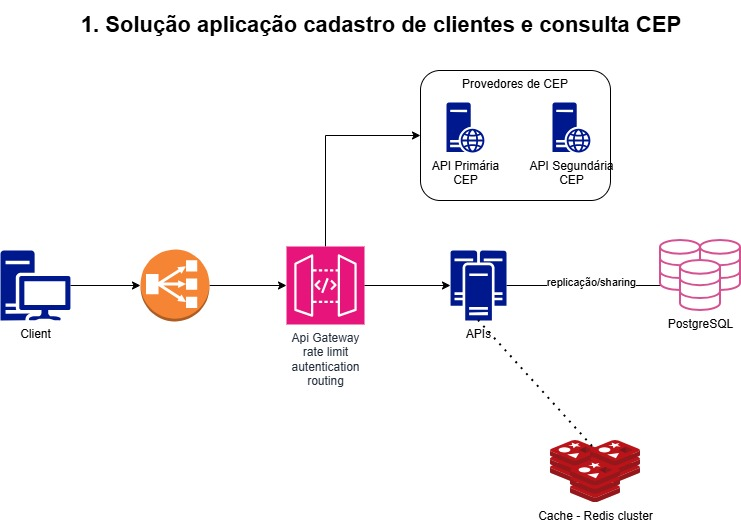
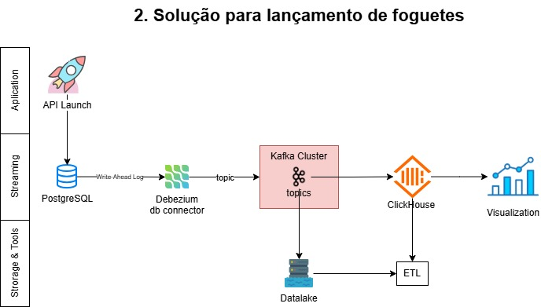

# Resoluções para o desafio da Shipay

[shipay-pag](https://github.com/shipay-pag/tech-challenges/blob/master/back_end/waimea/challenge.md)

## Desafio 1

1. Para todas as apis que eu for consulta eu emplementaria uma política de retry exponencial, adotando a "convenção" da comunidade de 3 tentativas e iniciando com 2 segundos, ou seja, se houver a primeira falha, depois de 2 segundos será retrentado, e havendo mais uma falha ele retentará após 4 segundos por conta do exponência que vai utilizar os 2 segundos de delay + 2 segundos da segunda tentativa, essa abordagem vai garantir que eu não envie mais de uma requisição por segundo na API que eu esteja consumindo para evitar qualquer tipo de bloqueio (rate limit) que essa api possa ter. Assim também evitamos sobrecarga nas apis.
2. Como mencionado acima eu também quero garantir que a minha API não sofra ataques de DDoS, ou seja, a principio eu adicionaria a funcionalidade de rete limit de 3 tentativas por segundo, ou seja, não poderá ter mais de 1 requisição dentro de cada 330 milissegundos, nesse caso eu retornaria o status 429 (To many request) para quem for consumir o recurso.
3. A primeiro momento, só de colocar o rate limit na API eu "melhoro" a performance da minha aplicação, ou seja, reduzindo a possibilidade de queda da API. Além de fazer o rate limit a nivel de api, eu deixaria também o API Gateway gerenciar o rate limite e outras como autenticação, logs, roteamento.
   Assim também evitar leituras e escritas desnecessárias no Banco de Dados (estou assumindo que tenha), eu implementária um serviço de cache (MainCache, Redis) para evitar consumos desnecessário no banco de dados, quanto nas apis de CEP, assim eu posso garantir uma resposta mais rápida, mas também adicionaria um TTL de 24 horas para cada CNPJ, garantindo que eu também possa evitar um armazenamento alto de Cache e também possibilidando "validar" que o endereço se mantenha iguais após uma outra consulta na API de CEP.
4. Para as duas APIs provedoras de CEP, eu utilizaria a abordagem de chamadas assincronas (promisse) a essas api para obter a resposta da primeira que responder, ao invés aguardar a primária e só acionar a api de CEP segundária caso ela falhe. e utilizaria também a definição do item 1.
5. Como é uma api de validação posso garantir que deva ter uma persistência e para isso eu utilizaria o PostgreSQL pela sua simplicitade e robustes.

Abaixo segue desenho da solução:

## Desafio 2

Para poder criar uma arquetura mais assertiva vou aferir algumas informações:

Quantos clientes existem? Vou partir da premissa que temos 100 empresas que lançam foguetes;
Quantos lançamentos de foguetes são feitos no intervalo de 30 dias? Vou aferir que são feitos 250 lançamentos a cada 30 dias (no mês), ou seja, um total de aproximadamenteo 3000 foguetes no ano;
Vou definir que também que os dados do relatório sejam em tempo real, possibilitando criar uma arquitetura escalavel que suporte ao longo do tempo;
Sobre os banco de dados: para o banco de dados principal será um PostgreSQL, levando em consideração sua robustes e baixa latência, além de poder utilizar utilizar algo como o Debezium para capturar alterações do banco de dados, já para o banco de dados secundário, vamos utilizar para fins de analytics, vamos utilizar um banco de dados colunar como ClickHouse ou um data warehouses por questão de volumetria, o Clickhouse é uma solução excelente trazendo redução de custo por um bom momento (anos).

A Arquitetura é moderada, não traz tanta complexidade:

1. O endpoint para lançamento deve ser assincrono, como informado no exemplo descrito no desafio;
2. O relatório também deve ser assíncrono, o uso do Debezium com o Kafka pode nos garantir um relatório em tempo real, monitorando os logs do Postgres com o Debezium e publicando no Kafka (Event Streaming);
3. Para consumir os eventos do Kafka podemos criar um worker que publica num data warehouse ou o podemos usar o ClickHouse que pode consumir diretamente no Kafka engine. O Interessante do uso do Kafka é que podemos utiliza-lo como Buffer e orquestrador para garantir que os lançamentos tenham uma ordem, caso necessário.

O Clickhouse é um banco colunar e que suporta inserção em tempo real, além de poder escalar linearmente em clusters.

Considerando que eu aferi que são poucas empresas e poucos lançamentos, isso também não impactaria se eu aumentasse consideralvemnte, vamos colocar um exemplo abaixo:

Clientes: 2000
Lançamentos de foguetes no ano 45 mil: aproximadamente 3.700 no mês;

Com esses dados eu não precisaria mudar a arquitetura, pois ela atende bem a mesma abordagem, também podemos levar em consideração um crescimento médio de 15% de lançamentos por anos, ou seja, no 5 ano seriam apróximadamente 78 mil lançamentos por anos ou 3750 por mês. Ainda assim teriamos uma relação de RPS muito baixa ( 0.0025).
Além disso também não faça sentido nenhum colocar algo armazenamento em cache, já que os lançamentos são unicos e não há a necessidade de consultar eles na aplicação

Abaixo segue desenho da solução:

## Desafio 3

Para os testes eu vou partir do principio que além da quantidade de requisições, há concorrência sobre o banco de dados, mesmo sendo em memmoria (cache) como mostrado no código do projeto.
Além de garantir que o Kafka é autogerenciado.

Testes unitários:
A base para todo o contexto é garantir que o unitário esteja idealmento bem implementado.

1. Mocks, para os eventos do kafka e no banco de dados, precisamos fazer mocks e garantir a estrutuda dos dados.
2. Importante garantir que um dado dentro do banco de dados seja removido após ser processado;
3. Testar as falhas caso o kafka não precesse a mensagem e ela volta para a fila local;
4. Caso tenha um TTL no redis, precisamos garantir que os eventos já expirados não vão serem enviados.

Teste de integração:

1. Precisamos garantir que os contratos estejam bem definidos de acordo com as versões das apis dos terceiros, já que podem mudar conforme o tempo, lançando novas versões.
2. Localmente precisamos subir o agendador, kafka e redis para simular cenários, com 1 mil eventos, 10 mil eventos e garantir a latência.
3. Testar a falha, quando o kafka não estiver disponível e/ou quando o redis não estiver disponível para validar o comportamento do agendador.

Teste de cargar:

1. em um ambiente local podemos limitar os recurso do kafka, redis e gerar requisições para verificar os picos de requisições e seus comportamentos de acordo com processamento. Uma informação importante é que não estamos olhando para o
   próximos passos no consumidor outros que possam existir, para isso podemos validar tanto 1 mil requisições por segundos, 2 mil e até 5 mil para entender em qual momento a solução pode sofrer sobrecarga.
2. em um ambiente de homologação, garantimos que tanto os componentes (kafka, redis e apis) estejam bem configurados, nesse caso testamos o máximo da aplicação com 1 mil requisições por segundo e também podemos enviar progressivamente mais requisções para entender em qual momento a solução pode falhar em uma Cloud com as configurações necessárias.

## Desafio 4

Para o desafio 4, tomei a liberdade de adicionar o projeto anti_patterns dentro do meu respositório e fazer comentários nos diffs só para ficar mais visual
